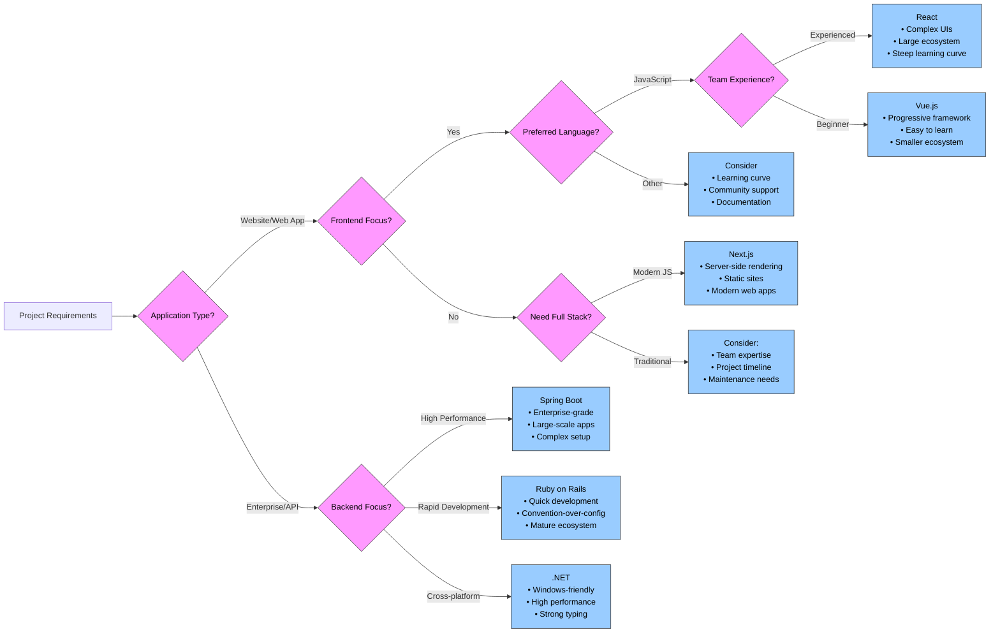

# Meeting Notes

## Outline

### Club Website

A group of students as been meeting each week to work on the club website.
**HAVE STUDENTS SHOW OFF THEIR PROGRESS**.

* Time: 3pm
* Where: ATC 200
* Day of the week: Tuesday

### Game Night

Last Game night was I failer.
We want this next one to be a success.
What can we do to with the next game night?

* When: August 5th
* Where: ATC 200
* What Game: Switch Sports

###  Personal Project Planning

I want you all to make a person project. It has to be something built outside of class that you would be proud of and put on your resume.
Over the summer I want you all to plan this project.
We have 6 club meeting.
I have come up with a 6-step plan we will be going though.
We are going to cover this during the club meeting, but you **MUST** work on this outside of these meeting to keep up.
This is to get them excited and motivated to build your personal project later. Here is my ideas so
far please add to it and make it take up the six club meetings.

1. **COMPLETE** Idea (What personal problem does it solve? )
2. **COMPLETE** Feature list and Rough wireframe
3. **COMPLETE** High Resolution wireframe / Integrative demo
4. Pick Tech Stack and UML for Database
5. Project Roadmap, Environment Setup, and Discovery

#### Personal Project Planning 4

UML

First pick if you want SQL or NoSQL.
Build a digram to plain out the schema for your database.
This UML does not need to be fully complete.
Don't waste your time chasing a complete design, it will have to change during development anyway.
You can use any tool you like including paper.
Some are code based, which can be nice do to it integrating with AI tools easier.
Below is a list of software I have used and recommend:
- [plantuml](https://plantuml.com/) Code based.
- [DBML](https://dbdiagram.io/d) Code based. Can be done in the browser
- [Diagrams.net](https://app.diagrams.net/) In browser drag and drop tool.
- Pen and Paper. Very fast but not very portable.

Tech Stack

This is the most opinionated part of the project.
Don't just pick something you have used before, branch out.
Ask your self the following questions.
What language do you like?
Do you want server or client side rendering?
Does the framework you choose have all the tooling you need?
What is the desired target platform?

My opinion?
If you have a lot of business logic, large db, or you see this app living for a long time.
I recommend a framework like .NET or Java Spring Boot.
If this is a fun side project I recommend Next.js or Svelte.
I am currently loving Svelte.
If you pick a Node.js framework hosting is also easier ([Vercel](https://vercel.com)).
But who doesn't like a beefy framework like .NET.

### End of Term

I don't know if you noticed but we have about two weeks left of summer term.
This part of the term is always stressful.
Of course be as focused on your work as possible and try to end the term strong.
But be mindful of your mental health.
Good sleep, diet and exercise makes a big difference.
End of term is August 14th last day of most of your CSD classes will be August 12th.

### Next Year 2025-2026

We only have one more club meeting this term.
We will finish up the next year schedule and send it out to everyone.

### Remainder Summer Schedule

Below is the schedule for all club meeting for summer term.

- August 6th

## Meeting Minutes

- Lucas kicks off meeting

- Game night August 5th

- Luke talks about next steps for personal project and suggestions
    - see suggestions above

- Luke shows off Field Projects website

- Caden talks and shows off everything that has been done for the new club website
    - hopefully fully functional by beginning of fall term

- Lucas says when the last meeting is for summer term

- Luke closes off meeting

## Attendance
Clayton	Ferguson,
Mike	OCarroll,
Lucas	Borton,
Laillah	Zainath,
Caden	Epp,
Shimea	Gbetsi
